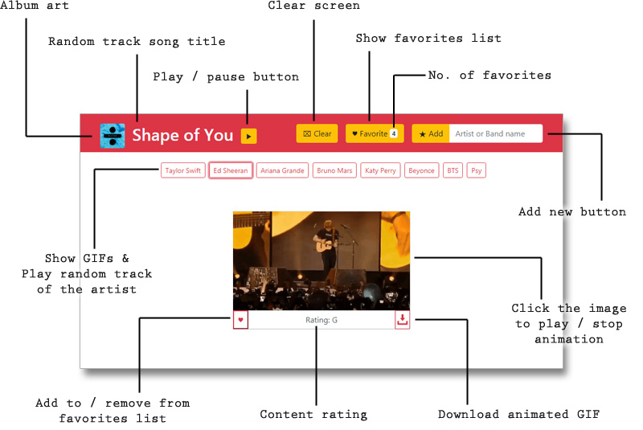

# GifTastic

### Overview

This is a dynamic web page that populates with gifs and plays random song of the artist that you chose.  
[Click here to try this app.](https://aka-joe.github.io/GifTastic/)

### How to Use



### Key Codes

At the first time that the user click the choice button, this code will get the values in position 0 ~ 9 of the result array.  
At the second time that the user click same choice buttonn, this code will get next values in position 10 ~ 19 of the array.  
If the user click same choice again, this code will get the values in position 20 ~ 29, and so on...

```
$(document).on("click", ".choice", function () {
  var query = $(this).val();
  var limit = Number($(this).attr("data-count"));
  $(this).attr("data-count", limit + 10);
  queryURL = "https://api.giphy.com/v1/gifs/search?rating=pg-13&q=" + query + "&limit=" + limit + "&api_key=" + APIkey;

  $.ajax({
    url: queryURL,
    method: "GET"
  }).then(function (response) {
    var results = response.data;
    for (var i = limit - 10; i < limit; i++) {
      ...
    };
  });
});
```

### Technology Used

* HTML
* CSS
* Javascript
* jQuery
* Bootstrap
* AJAX
* APIs (GIPHY & Itunes)